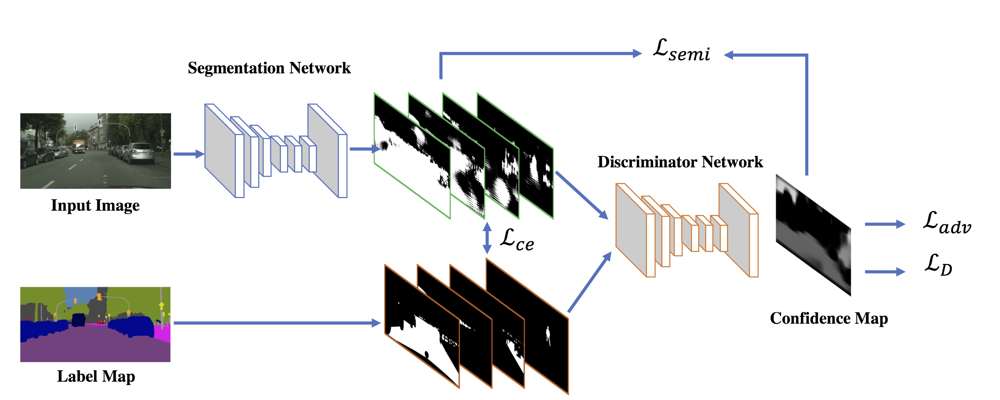

# Adversarial Learning for Semi-supervised Semantic Segmentation

This repo is the paddle implementation of the following paper:

[Adversarial Learning for Semi-supervised Semantic Segmentation](https://arxiv.org/abs/1802.07934) <br/>
[Wei-Chih Hung](https://hfslyc.github.io/), [Yi-Hsuan Tsai](https://sites.google.com/site/yihsuantsai/home), Yan-Ting Liou, [Yen-Yu Lin](https://www.citi.sinica.edu.tw/pages/yylin/), and [Ming-Hsuan Yang](http://faculty.ucmerced.edu/mhyang/) <br/>
Proceedings of the British Machine Vision Conference (BMVC), 2018.

Contact: Wei-Chih Hung (whung8 at ucmerced dot edu)



The code are heavily borrowed from a paddle DeepLab implementation). The baseline model is DeepLabv2-Resnet101 without multiscale training and CRF post processing, which yields meanIOU ``73.6%`` on the VOC2012 validation set. 

Please cite our paper if you find it useful for your research.
```
@inproceedings{Hung_semiseg_2018,
  author = {W.-C. Hung and Y.-H. Tsai and Y.-T. Liou and Y.-Y. Lin and M.-H. Yang},
  booktitle = {Proceedings of the British Machine Vision Conference (BMVC)},
  title = {Adversarial Learning for Semi-supervised Semantic Segmentation},
  year = {2018}
}
```

## 精度达标情况

| Performance | meanIOU |
|:---:|:---:|
| Target| 69.5| 
|train_result/iter(1500) | 69.37 | 

训练日志：

## Testing on VOC2012 validation set with pretrained models

```
bash evaluate_voc.sh
```

关键参数解释：  

`--data-path`:数据集存放的路径  
`--restore-from`：模型存放路径

## Training on VOC2012

```
bash train.sh
```

关键参数解释：  

`--data-path`:数据集存放的路径  
`--restore-from`：模型存放路径
`--snapshot-dir`：训练过程存放文件夹
